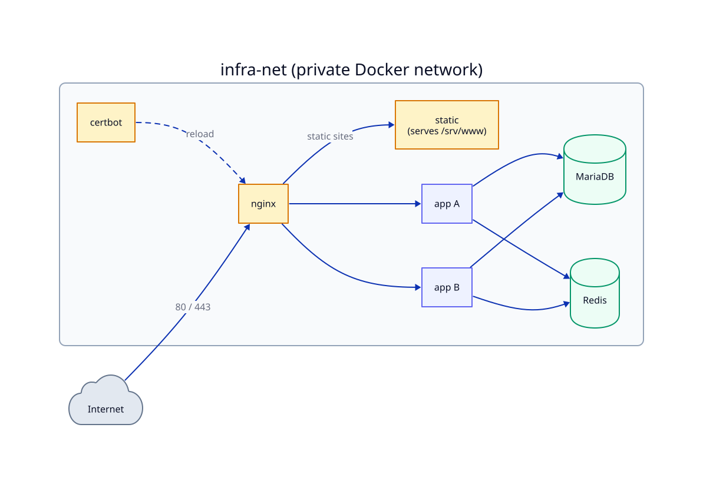

# 🏗️ Shared VPS Infrastructure

  

> **For:** DevOps / infra · **Purpose:** Shared VPS stack (nginx, MariaDB, Redis) — setup and ops.


> [!TIP]
> **New to servers / not a DevOps person?** Start with
> **[docs/learning-path.md](docs/learning-path.md)** — five guided modules covering foundations
> through operations, assuming no prior experience. The sections below are the terse reference.

> **Integrating a project?** See [docs/integrating-a-project.md](docs/integrating-a-project.md).

One stack per VPS: nginx, certbot, MariaDB, Redis. Projects attach via external
network `infra-net`. Every service declares `mem_limit` + `cpus` (multi-tenant box).

Error tracking uses **Sentry SaaS** — DSN only, no infra component. Set the DSN in the
project `.env` (`SENTRY_DSN`); the PHP Sentry SDK sends events directly to Sentry's
cloud endpoint. There is no self-hosted error-tracking service or dedicated database on this box.

**Architecture:**



**On this page:** [🚀 First-time setup](#-first-time-setup) · [🔒 TLS](#-tls) · [🔑 DB password rotation](#-db-password-rotation) · [🔌 Project connection](#-project-connection) · [🧭 Application-agnostic opt-in mechanisms](#-application-agnostic-opt-in-mechanisms) · [💾 Backups](#-backups)

## 🚀 First-time setup

**Step 1 — Run `provision-host.sh` as root** (installs Docker, ufw, fail2ban; creates the `deploy` user):

```bash
sudo bash provision-host.sh
```

**Step 2 — Install the deploy user's SSH public key** (do this before logging in as deploy):

```bash
mkdir -p /home/deploy/.ssh
nano /home/deploy/.ssh/authorized_keys     # paste your PUBLIC key
chown -R deploy:deploy /home/deploy/.ssh
chmod 700 /home/deploy/.ssh && chmod 600 /home/deploy/.ssh/authorized_keys
```


> [!CAUTION]
> sshd reads `authorized_keys` as the `deploy` user — if `.ssh` stays root-owned, key
> login silently falls back to a password (or is rejected entirely). Chown first, then log in.

> [!NOTE]
> `provision-host.sh` already enforces `chown -R deploy:deploy /home/deploy` on every run, so the home dir itself can't be left root-owned (which would otherwise break Docker/Composer). You still set `.ssh` ownership manually above.

**Step 3 — Bootstrap the infra stack** (as `deploy` or root from `/opt/infra`):

```bash
sudo mkdir -p /opt/infra && sudo cp -r infra/* /opt/infra/
cd /opt/infra
cp .env.example .env && nano .env    # MARIADB root pw, per-project pw, REDIS_PASSWORD
chmod 600 .env                       # belt-and-suspenders: bootstrap.sh enforces this automatically; generate REDIS_PASSWORD: openssl rand -hex 32
./bootstrap.sh
# Per-project vhosts are rendered by register-project.sh (see below)
```

`REDIS_PASSWORD` is required on a multi-tenant box — every project `.env` must copy the same
value from `infra/.env` (Redis runs with `--requirepass`). Empty = no auth, acceptable only on an isolated dev box.

**SQL init:** `./render-init-sql.sh` keeps the init-mount path valid on a fresh volume — the
template (`init/mariadb/01-databases.sql.template`) is a no-op placeholder (`SELECT 1;`) and
carries no credentials. Per-project databases and users are created idempotently by
`register-project.sh`, not by the init SQL.

---

## 🔒 TLS

```bash
docker compose run --rm --entrypoint certbot certbot certonly --webroot -w /var/www/certbot \
  -d example.com --agree-tos -m you@example.com --no-eff-email
docker compose exec nginx nginx -s reload
```

Renewals are automatic: certbot renews every 12 h and touches `/etc/letsencrypt/.reload-pending`;
the nginx container's poll loop reloads within 60 s (no docker-socket reloader sidecar).
Force manually: `docker compose exec nginx nginx -s reload`.

---

## 🔑 DB password rotation

`render-init-sql.sh` only runs on a **fresh** DB volume; it does not change existing passwords.
To rotate a password after first boot, use the helper:

```bash
cd /opt/infra
./rotate-db-password.sh <db_user>            # prod DB user
```

The script prompts for the new password (never passed on the command line — avoids `ps` exposure),
issues `ALTER USER` inside the running MariaDB container, then prints the `.env` files you must
update manually. After editing, restart the affected project container(s):

```bash
cd /opt/<project>
docker compose restart   # restart the project's app container(s) to pick up the new password
```

Note: `GRANT ALL PRIVILEGES ON <db>.*` in `init/mariadb/01-databases.sql.template` is DB-scoped —
the user can only access the named database. It carries no SUPER, GRANT OPTION, FILE, or global
privileges.

---

## 🔌 Project connection

| Variable | Prod |
|----------|------|
| `DB_HOST` / `REDIS_HOST` | `mariadb` / `redis` |
| `DB_NAME` | `<project_db>` |
| `REDIS_DB` | `0` |
| `REDIS_PASSWORD` | copy the value of `REDIS_PASSWORD` from `infra/.env` |

`COMPOSE_FILE` must include the prod overlay.

**TLS cert must exist before registering a project.** `register-project.sh` will not write the
SSL vhost until the cert is present (a missing cert would break nginx on restart). Correct order:
obtain the cert via certbot first, then run (or re-run) `register-project.sh`.

**Project manifest variables:** `register-project.sh` reads a `project.env` manifest. Each
project vhost gets a conservative self-only Content-Security-Policy by default; set `CSP=...` in
the manifest to override it per project.

### 🗂️ Static sites

Frontend-only sites (no app container, no DB) use `register-static-site.sh <manifest>` instead
of `register-project.sh`.

Files are served from `/srv/www/<domain>/` — a host directory mounted read-only by the shared
`static` container. To deploy or update a site, rsync the build in; no re-registration needed.

Manifest (`static.env`) requires `PROJECT_NAME`, `DOMAIN`, and `STATIC_FALLBACK`:
- `spa` — serves `index.html` as fallback (client-side routing)
- `static` — returns `404` for missing files

Do **not** set `UPSTREAM` — the script hard-codes `static:8080`.

The same cert-guard applies: obtain the TLS cert via certbot before running `register-static-site.sh`.

See [docs/integrating-a-project.md](docs/integrating-a-project.md) (static site section) and
[docs/examples/static.env](docs/examples/static.env) for the full manifest reference.

---

## 🧭 Application-agnostic opt-in mechanisms

Infra is fully application-agnostic — it ships no app-specific policy. Projects that
need app-specific behaviour opt in via two mechanisms:

**Scheduled tasks:** Infra installs no cron jobs. A project that needs scheduled work (e.g.
scheduled jobs (cron, queue workers, periodic cleanup)) runs it from its own `docker-compose` (a cron sidecar container), not from
the host.

**Custom nginx locations / rate-limiting:** Infra exposes a generic `auth_limit` rate-limit zone.
A project that wants rate-limited endpoints or any custom `location` rules ships
`deploy/nginx-locations.conf`; `register-project.sh` installs it into
`conf.d/locations/<project>/` and the vhost includes it automatically. Example snippet a project
might ship:

```nginx
location = /admin-login {
    limit_req zone=auth_limit burst=5 nodelay;
    proxy_pass http://<upstream>;
    proxy_set_header Host $host;
    proxy_set_header X-Real-IP $remote_addr;
    proxy_set_header X-Forwarded-For $proxy_add_x_forwarded_for;
    proxy_set_header X-Forwarded-Proto $scheme;
}
```

---

## 💾 Backups

DB dumps, uploads archives, and the GPG-encrypted `.env` are stored on the VPS under
`/var/backups/<project>/` and swept after `BACKUP_LOCAL_DAYS` days (default 14). Offsite upload
is currently disabled — all backups are local-only on this VPS.

**Backups are manual** — infra installs no scheduled jobs of any kind. Run them on demand:
`backup/backup.sh <project.env>` on the VPS, or use `pull-backup.sh` from your machine (see below).
Each `backup.sh` run prunes local copies older than `BACKUP_LOCAL_DAYS` days.


> [!IMPORTANT]
> `.env.example` ships `BACKUP_REQUIRE_ENV_BACKUP=1`, so a plain `backup.sh` run refuses
> to proceed unless `BACKUP_GPG_PASSPHRASE` is set. Either use `--encrypt-all` and set the
> passphrase, or explicitly set `BACKUP_REQUIRE_ENV_BACKUP=0` to opt out of the guard.

### Manual encrypted pull

Backups are manual — run them on demand. `backup.sh --encrypt-all` bundles the database, uploads, and `.env` into a single GPG-encrypted file `bundle-<stamp>.tar.gz.gpg` (AES-256; passphrase from `BACKUP_GPG_PASSPHRASE` in `infra/.env`, never on the command line).

From your local machine, `pull-backup.sh` runs that remotely over SSH and rsyncs the bundle down in one step:

```bash
./pull-backup.sh deploy@your-vps /opt/<project>/deploy/project.env ~/vps-backups
```

The third argument (local destination) is optional and defaults to `~/vps-backups`. The bundle lands in `~/vps-backups/<project>/`.

To restore from a pulled bundle (you are prompted for `BACKUP_GPG_PASSPHRASE` locally):

```bash
mkdir restore && gpg -d ~/vps-backups/<project>/bundle-<stamp>.tar.gz.gpg | tar -xzvf - -C restore
# yields .env, db-*.sql.gz, uploads-*.tar.gz — copy ./restore to the VPS and point restore.sh at it
```

Keep at least two copies (e.g. laptop + external drive), store the passphrase in a password manager (not only on the VPS), and test a restore occasionally.

---

**Docs:** [📚 Lessons course](docs/learning-path.md)  ·  [📋 Runbook](docs/deploying-to-a-vps.md)  ·  [🔗 Integrate a project](docs/integrating-a-project.md)
