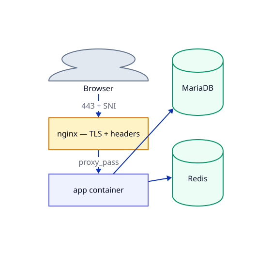

# 🌐 Module 2 — Inside the stack: request path & data

 

Cross-refs: `01-foundations.md`, `03-deploy-phase-1.md`, `04-add-an-application-phase-2.md`, `05-operate-and-design.md`.

**On this page:** [🌐 Request path & TLS](#-request-path--tls) · [🗄️ Data layer](#-data-layer) · [🎯 What you can do after this](#-what-you-can-do-after-this)

---

## 🌐 Request path & TLS

**Request path:**



### Contrast with managed cloud

On a managed cloud, a load balancer terminates TLS using a managed cert service (e.g. ALB+ACM, Cloud LB + Certificate Manager) and forwards plain HTTP to target groups. Here nginx does the same job: it terminates TLS, adds security headers, and `proxy_pass`es over the private `infra-net` Docker network to the app container. The app never handles TLS.

### Port 80: dual role

```nginx
# nginx/nginx.conf
server {
    listen 80 default_server;
    server_name _;

    location /.well-known/acme-challenge/ {
        root /var/www/certbot;
    }

    location / {
        return 301 https://$host$request_uri;
    }
}
```

Port 80 does two things simultaneously:

- Redirects all regular traffic to HTTPS.
- Serves `/.well-known/acme-challenge/` for Let's Encrypt webroot validation over plain HTTP — the cert doesn't exist yet (or may be expiring), so this path cannot be redirected to HTTPS.

A managed cert service handles validation invisibly in the cloud; here certbot needs the webroot challenge reachable on port 80.

### Port 443: unknown-SNI rejection

```nginx
# nginx/nginx.conf
server {
    listen 443 ssl default_server;
    http2 on;
    ssl_reject_handshake on;
}
```

`ssl_reject_handshake on` sends a TLS alert and no certificate when the SNI hostname doesn't match any configured vhost. A client hitting the raw VPS IP, or an unconfigured domain, gets a hard connection error rather than leaking which cert is in use. This is VPS-specific anti-enumeration; a managed load balancer behind managed DNS (Route 53 / Cloud DNS / Azure DNS) doesn't expose its IP directly.

### Per-project vhost: template rendering

`register-project.sh` renders `nginx/conf.d/vhost.conf.template` via `sed`, substituting four placeholders:

| Placeholder | Replaced with |
|---|---|
| `PROD_DOMAIN` | The project's domain (e.g. `app.example.com`) |
| `__UPSTREAM__` | Container name + port on `infra-net` (e.g. `myapp-app-1:80`) |
| `__CSP__` | Per-project CSP string (from manifest `CSP=` var, or a safe default) |
| `__PROJECT_NAME__` | Project name slug; used in `include conf.d/locations/<name>/*.conf` |

The rendered file is written to `nginx/conf.d/<PROJECT_NAME>.conf`.

```nginx
# nginx/conf.d/vhost.conf.template (abridged)
server {
    listen 443 ssl http2;
    server_name PROD_DOMAIN;

    ssl_certificate     /etc/letsencrypt/live/PROD_DOMAIN/fullchain.pem;
    ssl_certificate_key /etc/letsencrypt/live/PROD_DOMAIN/privkey.pem;
    ssl_protocols       TLSv1.2 TLSv1.3;
    ssl_ciphers         HIGH:!aNULL:!MD5;
    ssl_session_cache   shared:SSL:10m;

    add_header Strict-Transport-Security  "max-age=31536000" always;
    add_header X-Content-Type-Options     "nosniff" always;
    add_header X-Frame-Options            "SAMEORIGIN" always;
    add_header Referrer-Policy            "strict-origin-when-cross-origin" always;
    add_header Permissions-Policy         "geolocation=(), microphone=(), camera=(), payment=()" always;
    add_header Content-Security-Policy-Report-Only "__CSP__" always;

    include /etc/nginx/conf.d/locations/__PROJECT_NAME__/*.conf;

    location / {
        proxy_pass http://__UPSTREAM__;
        proxy_set_header Host              $host;
        proxy_set_header X-Real-IP         $remote_addr;
        proxy_set_header X-Forwarded-For   $proxy_add_x_forwarded_for;
        proxy_set_header X-Forwarded-Proto $scheme;
        proxy_read_timeout 60s;
    }
}
```

> [!NOTE]
> `nginx/conf.d/00-security-headers.conf.template` is now a comment-only placeholder. All security headers moved into `vhost.conf.template` so they remain per-project and project-agnostic at the infra level. The file is kept so the mount path stays valid.

### CSP promotion path

CSP starts `Report-Only`. The template comment documents the promotion steps:

1. Confirm zero violations in browser/server logs over at least one week.
2. Rename the header from `Content-Security-Policy-Report-Only` to `Content-Security-Policy`.
3. Tighten any `'unsafe-inline'` allowances to nonces/hashes once the app's inline CSS/JS is eliminated.

### Rate-limit zone: `auth_limit`

```nginx
# nginx/nginx.conf
limit_req_zone $binary_remote_addr zone=auth_limit:10m rate=5r/m;
```

The zone is defined globally (10 MB ≈ 160,000 tracked IPs, 5 requests/minute per IP) but applied only where a project opts in via its `deploy/nginx-locations.conf` snippet:

```nginx
limit_req zone=auth_limit burst=5 nodelay;
```

Think of it as a managed-WAF rate rule that projects activate selectively — typically on auth or admin paths.

### certbot renewal and nginx reload

```yaml
# docker-compose.yml — certbot
entrypoint: >
  sh -c "trap exit TERM;
         while :; do
           certbot renew --webroot -w /var/www/certbot --quiet \
             --deploy-hook 'touch /etc/letsencrypt/.reload-pending';
           sleep 12h & wait $${!};
         done"
```

certbot loops with a ~12h sleep. On renewal its deploy-hook touches `/etc/letsencrypt/.reload-pending`. nginx's own startup command runs a background poll loop:

```yaml
# docker-compose.yml — nginx command
command: >
  sh -c '
    (
      while sleep 60; do
        if [ -f /etc/letsencrypt/.reload-pending ]; then
          rm -f /etc/letsencrypt/.reload-pending;
          nginx -s reload 2>&1 || true;
        fi;
      done
    ) &
    exec nginx -g "daemon off;"
  '
```

Every 60 seconds nginx checks for the file; if present it reloads and removes it. No `docker.sock` mount is required. The previous sidecar approach (alpine container + `docker-cli` + RW docker socket) was removed because a code-execution bug in that loop yielded host root. The deep rationale for this design choice lives in `05-operate-and-design.md`.

> [!CAUTION]
> nginx validates all loaded configs on container start. A `443 ssl` vhost pointing at a missing cert file causes nginx to fail to boot — crashing all sites via `restart: unless-stopped`. `register-project.sh` checks cert existence inside the nginx container before rendering, runs `nginx -t`, and removes the vhost file if validation fails. Do not bypass this guard.

---

## 🗄️ Data layer

### MariaDB: one server, one DB per tenant

| Managed cloud | This stack |
|---|---|
| A managed database per app, or multi-tenant with managed auth | One MariaDB 11.4 container, one database + user per tenant |
| `mem_limit` managed by instance class | `mem_limit: 768m`, `cpus: 1.0` |
| Automated backups via managed snapshots | `mariadb_data` volume; backup via project hooks + `backup/backup.sh` |

Buffer pool is set explicitly:

```yaml
# docker-compose.yml — mariadb command
--innodb-buffer-pool-size=384M
--max-connections=100
```

`register-project.sh` provisions each tenant's DB:

```sql
CREATE DATABASE IF NOT EXISTS `${DB_NAME}` CHARACTER SET utf8mb4 COLLATE utf8mb4_unicode_ci;
CREATE USER IF NOT EXISTS '${DB_USER}'@'%' IDENTIFIED BY '${DB_PASSWORD}';
GRANT ALL PRIVILEGES ON `${DB_NAME}`.* TO '${DB_USER}'@'%';
FLUSH PRIVILEGES;
```

The `GRANT … ON \`db\`.*` scope is the entire isolation boundary. The tenant user can do anything inside its own database; it cannot list or touch any other tenant's database. This replaces the managed-database + IAM-policy model with SQL privilege scoping.

The operation is idempotent: `IF NOT EXISTS` on both `CREATE DATABASE` and `CREATE USER` makes it safe to re-run.

**SQL injection guard.** Before interpolating any manifest variable into the SQL string, `register-project.sh` runs validators from `lib/common.sh`:

```bash
validate_identifier "DB_NAME"  "${DB_NAME}"   # only [A-Za-z0-9_]
validate_identifier "DB_USER"  "${DB_USER}"   # only [A-Za-z0-9_]
validate_password_literal "DB_PASSWORD …" "${DB_PASSWORD}"  # rejects ', \, newline
```

The password is passed via `MYSQL_PWD` env var (`docker exec -e MYSQL_PWD=…`), never on the command line, so it doesn't appear in `ps` output to other tenants.

### Two credential tiers

```
MARIADB_ROOT_PASSWORD   — infra scripts only (register-project.sh, rotate-db-password.sh)
                          never passed to any app container
${PROJECT_NAME^^}_PASSWORD  — e.g. MY_APP_PASSWORD for project my-app
                              passed only to that tenant's container
                              leak exposes one tenant, not the whole server
```

The variable name is derived in `register-project.sh` as `${PROJECT_NAME^^}_PASSWORD` with `-` → `_` (e.g. `my-app` → `MY_APP_PASSWORD`).

### init SQL: no-op placeholder

`init/mariadb/01-databases.sql.template` contains only `SELECT 1;`. `render-init-sql.sh` copies it verbatim (no sed substitution). Per-project databases are created at registration time by `register-project.sh` against the running container, so the init mount is intentionally inert. This means adding a tenant never requires wiping the MariaDB volume.

### Redis: shared instance, namespace isolation

| Managed cloud | This stack |
|---|---|
| A managed cache with managed auth, one cluster per app | One Redis 7.4-alpine container, shared by all tenants |
| `mem_limit` managed by node type | `mem_limit: 320m`, `cpus: 0.25` |

```yaml
# docker-compose.yml — redis command
--maxmemory 256mb --maxmemory-policy allkeys-lru --appendonly no --requirepass "$$REDIS_PASSWORD"
```

Key facts:

- **No multi-user ACL** (contrast: a managed cache with managed auth). Authentication is a single shared password (`REDIS_PASSWORD` in `infra/.env`). All tenants use the same password; isolation is by convention, not by credential.
- **Namespace separation.** Each tenant sets `REDIS_DB=<n>` in its manifest to select a numbered database (0–15). Data in DB 0 is invisible to a client on DB 1. Not cryptographic isolation — just key-space separation.
- **Ephemeral by design.** `--appendonly no` means Redis is pure cache. On restart the cache is cold and rebuilds from traffic. `redis_data` volume exists but holds nothing durable in this config.
- **`allkeys-lru` eviction.** When memory hits 256 MB, the least-recently-used keys are evicted. Appropriate for a web cache workload.

> [!NOTE]
> If `REDIS_PASSWORD` is unset, Redis starts without auth (acceptable for isolated local dev, logged with a warning). On the live VPS it must be set.

---

## 🎯 What you can do after this

- Read `nginx/conf.d/vhost.conf.template` and predict exactly what `register-project.sh` will write to `nginx/conf.d/<project>.conf` for a given manifest.
- Explain to a teammate why a `443 ssl` vhost for a domain without a cert would crash all sites, and which lines in `register-project.sh` prevent that.
- Trace the full credential flow for a new project: from `.env` variable name derivation, through `validate_password_literal`, to `MYSQL_PWD` env injection and `GRANT` scope.

---

[← Module 1 · Foundations](01-foundations.md)  ·  [📚 Course index](../learning-path.md)  ·  [Module 3 · Deploy Phase 1 →](03-deploy-phase-1.md)
