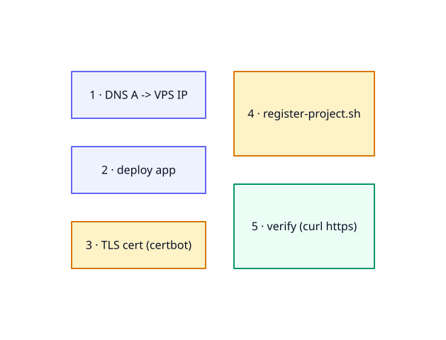

# 📦 Module 4 — Phase 2: add an application

 

**Where this fits:** the shared infra from Phase 1 is already running. This module covers the contract a tenant project must satisfy (Part A) and the exact sequence to bring a project live (Part B).

Full contract reference: [docs/integrating-a-project.md](../integrating-a-project.md). Backup/restore engine details and day-2 operations: [Module 5](05-operate-and-design.md).

**On this page:** [🔌 Part A — the contract](#-part-a--the-contract) · [🚀 Part B — go live](#-part-b--go-live) · [🗂️ Part C — the static-site path](#️-part-c--the-static-site-path-a-simpler-tenant) · [🎯 What you have now](#-what-you-have-now)

---

## 🔌 Part A — the contract

### The manifest: `deploy/project.env`

Create `deploy/project.env` at the root of your project's `deploy/` directory. No secrets — this file is safe to commit.

| Variable | Required by | Charset | Notes |
|---|---|---|---|
| `PROJECT_NAME` | `register-project.sh`, backup engine | `[A-Za-z0-9_-]` | Names the vhost conf, `conf.d/locations/<name>/`, and backup dir. |
| `DOMAIN` | `register-project.sh` | valid hostname | nginx `server_name` and TLS cert domain. |
| `UPSTREAM` | `register-project.sh` | `[A-Za-z0-9_.:-]+` | Your container and port on `infra-net`, e.g. `myapp:8080`. **Must be unique across the whole box.** |
| `DB_NAME` | `register-project.sh` | `[A-Za-z0-9_]` | Database to create (idempotent). |
| `DB_USER` | `register-project.sh` | `[A-Za-z0-9_]` | DB user (granted on `DB_NAME` only). |
| `PROJECT_DIR` | backup engine | absolute path | e.g. `/opt/myapp`. |
| `CSP` | `register-project.sh` | CSP string | **Optional.** Sent as `Content-Security-Policy-Report-Only`. Defaults to a safe self-only policy. |

See the copy-paste template at [`docs/examples/project.env`](../examples/project.env).

### DB password: the derived var name

The DB password is **not** in the manifest. The operator adds it to `/opt/infra/.env` before running `register-project.sh`:

```ini
<PROJECT_NAME>_PASSWORD=<strong-password>
```

`register-project.sh` derives the var name by uppercasing `PROJECT_NAME` and replacing `-` with `_`:

```
PROJECT_NAME=my-app  →  MY_APP_PASSWORD
PROJECT_NAME=myapp   →  MYAPP_PASSWORD
```

The script exits immediately if the variable is absent. Generate the password with:

```bash
openssl rand -hex 32
```

### Network and connection env

Your app container must join the external `infra-net` network and must **not** publish host ports. The service/alias name on `infra-net` is what `UPSTREAM` points at — name it the same as `PROJECT_NAME` unless you have a reason not to.

```yaml
# docs/examples/docker-compose.snippet.yml
services:
  myapp:
    image: your/app:latest
    restart: unless-stopped
    env_file: .env
    networks:
      - infra-net

networks:
  infra-net:
    external: true
    name: infra-net
```

Your app's own `.env` (hand-authored on the VPS, not generated by infra) supplies the connection env:

| Variable | Value |
|---|---|
| `DB_HOST` | `mariadb` (hardcoded — service name on `infra-net`) |
| `DB_NAME` | your `DB_NAME` from the manifest |
| `DB_USER` | your `DB_USER` from the manifest |
| `DB_PASSWORD` | same value as `<PROJECT>_PASSWORD` in `infra/.env` |
| `REDIS_HOST` | `redis` |
| `REDIS_PASSWORD` | **same value as `REDIS_PASSWORD` in `infra/.env`** — shared across all projects; do not generate a new one |
| `REDIS_DB` | `0` (default) — use a different integer per project for namespace isolation |

`DB_HOST=mariadb` resolves because both containers share `infra-net` and Docker makes each service reachable by name over it. Infra does not generate your project's `.env`.

### Optional: nginx rate-limiting

Infra exposes an `auth_limit` zone. To opt in — or add any custom `location` blocks — ship `deploy/nginx-locations.conf` next to your manifest. `register-project.sh` installs it into `nginx/conf.d/locations/<PROJECT_NAME>/locations.conf`, which the vhost template includes inside the `443` server block.

```nginx
# docs/examples/nginx-locations.conf
location = /login {
    limit_req zone=auth_limit burst=5 nodelay;
    proxy_pass http://myapp:8080;
    proxy_set_header Host              $host;
    proxy_set_header X-Real-IP         $remote_addr;
    proxy_set_header X-Forwarded-For   $proxy_add_x_forwarded_for;
    proxy_set_header X-Forwarded-Proto $scheme;
}
```

If the file is absent, the project gets a plain reverse proxy.

### Backup/restore hooks

Infra decides *when* and *how* the backup cycle runs; your project decides *what* to back up. Ship two executable scripts:

- `deploy/hooks/backup.sh` — called with `STAMP`, `BACKUP_DIR`, `APP_DIR` set. **Must** write `${BACKUP_DIR}/db-${STAMP}.sql.gz`. May also write `${BACKUP_DIR}/uploads-${STAMP}.tar.gz`.
- `deploy/hooks/restore.sh` — called with `APP_DIR`, `DB_FILE`, `UPLOADS_FILE` set. Restores from those files.

See [`docs/examples/hooks/backup.sh`](../examples/hooks/backup.sh) and [`docs/examples/hooks/restore.sh`](../examples/hooks/restore.sh). Full engine details in Module 5.

### Scheduled tasks

Infra installs no cron. If your app needs periodic work, run it as a sidecar container in your own `docker-compose` file. The sidecar joins `infra-net`, uses the same image, and loops on its own timer. Infra is not involved.

---

## 🚀 Part B — go live

**Go-live flow:**



> [!CAUTION]
> The steps below have a load-bearing order. Cert before register. Deviating from it can crash nginx for every site on the box — see the cert-guard note in Step 3.

### Step 1 — point DNS at the VPS

Create an A record at your registrar:

```
<domain>.    A    <VPS_IP>    TTL 300
```

Let's Encrypt verifies that the domain resolves to your server before issuing a cert. Do this first and confirm propagation:

```bash
dig +short <domain>
```

Expected output: your VPS IP, nothing else.

### Step 2 — deploy the project and start its stack

SSH in as `deploy`, clone/deploy the project to `/opt/<project>`, then create its `.env`:

```bash
chmod 600 /opt/<project>/.env
```

Fill in `DB_HOST=mariadb`, `DB_PASSWORD` (from `<PROJECT>_PASSWORD` in `/opt/infra/.env`), `REDIS_HOST=redis`, `REDIS_PASSWORD` (copied exactly from `REDIS_PASSWORD` in `/opt/infra/.env`), and any app-specific vars.

Start the production stack:

```bash
cd /opt/<project>
docker compose up -d
```

The app may take a moment to start. It has no database yet — that happens in Step 4.

### Step 3 — get the TLS certificate (BEFORE registering)

Run from `/opt/infra`:

```bash
docker compose run --rm --entrypoint certbot certbot certonly --webroot -w /var/www/certbot \
  -d <domain> --agree-tos -m <you@example.com> --no-eff-email
```

Replace `<domain>` and `<you@example.com>` with your values.


> [!CAUTION]
> Registering a `443` vhost before the cert exists on disk causes nginx to fail config validation on reload or restart. With `restart: unless-stopped`, this becomes a crash-loop that takes down **every site on the box**. `register-project.sh` is cert-guarded — it checks whether the cert file exists inside the nginx container and refuses to write the vhost if it doesn't — but the guard only protects you if you call `register-project.sh` *after* the cert is in place.

**What success looks like:** certbot prints `Your certificate and chain have been saved at /etc/letsencrypt/live/<domain>/fullchain.pem`.

If it fails with a DNS error, the A record hasn't propagated yet — wait and retry. If it fails with connection refused, verify nginx is running with `docker compose ps` from `/opt/infra`.

### Step 4 — register the project

Run from `/opt/infra`:

```bash
./register-project.sh /opt/<project>/deploy/project.env
```

What the script does in order:

1. Validates all manifest vars against their allowed charsets.
2. Looks up `<PROJECT_NAME>_PASSWORD` from `infra/.env`; exits if missing.
3. Creates the database and user (idempotent — safe to re-run):
   ```sql
   CREATE DATABASE IF NOT EXISTS `<DB_NAME>` CHARACTER SET utf8mb4 COLLATE utf8mb4_unicode_ci;
   CREATE USER IF NOT EXISTS '<DB_USER>'@'%' IDENTIFIED BY '<password>';
   GRANT ALL PRIVILEGES ON `<DB_NAME>`.* TO '<DB_USER>'@'%';
   ```
4. If `deploy/nginx-locations.conf` exists alongside the manifest, copies it into `nginx/conf.d/locations/<PROJECT_NAME>/locations.conf`.
5. Renders the vhost from the template into `nginx/conf.d/<PROJECT_NAME>.conf`.
6. Runs `nginx -t` inside the nginx container. If validation fails, removes the vhost file immediately and exits — the bad config cannot poison nginx. If validation passes, reloads nginx.

The cert-guard (step 6 of the script's logic, line 47 in `register-project.sh`) checks for the cert file inside the nginx container before writing the vhost at all. If absent, it skips the vhost entirely and prints the certbot command you need to run.

Re-running the script is safe.

### Step 5 — verify

```bash
curl -I https://<domain>
```

Expect `HTTP/2 200` or a `301`/`302`. The `server: nginx` header confirms the request went through the shared nginx. Check the browser padlock.

### Cert renewal

The certbot container wakes every ~12 hours and renews any cert within 30 days of expiry. On renewal it touches `/etc/letsencrypt/.reload-pending`. The nginx container polls that file every 60 seconds and issues `nginx -s reload`, picking up the new cert without a restart. Nothing to do manually.

---

## 🗂️ Part C — the static-site path (a simpler tenant)

### Framing: when there is no server-side runtime

Not every tenant runs application server code. If your project is a built frontend — a React SPA, a Next.js export, a plain HTML/CSS/JS site — there is nothing to containerize and no database to provision. In managed cloud you would reach for a managed static-hosting service or a CDN origin: S3 + CloudFront, Cloud Storage + Cloud CDN, or Azure Static Web Apps. The self-managed equivalent here is a dedicated `static` nginx container that serves files from `/srv/www/<domain>/` on the host filesystem, matched to incoming requests by `Host` header. The edge nginx still terminates TLS and reverse-proxies to it, exactly as it does for any other tenant — but the upstream is always the shared `static` container at `static:8080`, not a per-project app container.

### Why a separate container

Keeping static file-serving in its own container preserves the application-agnostic property of the edge nginx. The `static` container has no knowledge of any individual site; its per-site configuration is rendered runtime state (a server block written to `nginx-static/conf.d/<PROJECT_NAME>.conf`), just like the per-project vhosts in `nginx/conf.d/`. Adding or removing a static site rewrites one rendered file and reloads the static container — no other tenant is touched.

### A slimmer contract than Part A

Compared to the app-container path, the static manifest is considerably shorter. There is no upstream to name, no database to provision, and no connection env to set.

| What | App-container tenant (Part A) | Static tenant (Part C) |
|---|---|---|
| Manifest file | `deploy/project.env` | `deploy/static.env` |
| `PROJECT_NAME` | required | required |
| `DOMAIN` | required | required |
| `UPSTREAM` | required — your container:port | **not set** — script hard-codes `static:8080` |
| `DB_NAME` / `DB_USER` | required | **not used** — no DB is created |
| DB password in `infra/.env` | required before registering | **not required** |
| `STATIC_FALLBACK` | not applicable | required — `spa` or `static` |
| `CSP` | optional | optional |
| Connection env in app | hand-authored `.env` on VPS | **none** — no runtime |
| Backup hooks | required | optional — files live on disk; back up at the filesystem level if wanted |
| nginx-locations snippet | optional | not supported |

`STATIC_FALLBACK` controls how nginx handles a path that does not map to a real file:

- `spa` — falls back to `index.html`, enabling client-side routing (React Router, Vue Router, etc.).
- `static` — returns a real 404, correct for plain multi-page sites where every URL should map to an actual file.

See the copy-paste template at [`docs/examples/static.env`](../examples/static.env) and the full static-section reference in [`docs/integrating-a-project.md`](../integrating-a-project.md#️-static-sites-frontend-only-no-app-container).

### Go live (shorter, same load-bearing order)

The same cert-before-register rule applies. Deviating from the order can crash the edge nginx for every site on the box.

**Step 1 — point DNS and deploy the build**

Create the A record and confirm propagation (same as Part B Step 1). Then create the web root on the VPS and rsync your build into it:

```bash
mkdir -p /srv/www/<domain>
rsync -a ./dist/ deploy@<VPS_IP>:/srv/www/<domain>/
```

There is no app container to start.

**Step 2 — obtain the TLS certificate (BEFORE registering)**

Run from `/opt/infra`, exactly as in Part B Step 3:

```bash
docker compose run --rm --entrypoint certbot certbot certonly --webroot -w /var/www/certbot \
  -d <domain> --agree-tos -m <you@example.com> --no-eff-email
```

> [!CAUTION]
> `register-static-site.sh` applies the same cert-guard as `register-project.sh`: it will not write the SSL edge vhost until the certificate exists on disk. Obtain the cert first.

**Step 3 — register**

Run from `/opt/infra`:

```bash
./register-static-site.sh /opt/<project>/deploy/static.env
```

What the script does in order:

1. Validates `PROJECT_NAME`, `DOMAIN`, and `STATIC_FALLBACK` against their allowed charsets.
2. Resolves `STATIC_FALLBACK` to an nginx `try_files` directive and renders `nginx-static/site.conf.template` → `nginx-static/conf.d/<PROJECT_NAME>.conf`.
3. Runs `nginx -t` inside the `static` container. On failure, removes the rendered block immediately (same poison-prevention logic as the edge nginx guard) and exits.
4. If validation passes, reloads the `static` container, then calls the shared `render_edge_vhost` function — the same cert-guarded function used by `register-project.sh` — which writes and validates `nginx/conf.d/<PROJECT_NAME>.conf` and reloads the edge nginx.

No database is created. No password lookup is performed.

**Step 4 — verify**

```bash
curl -I https://<domain>
```

Expect `HTTP/2 200`. The `server: nginx` header confirms the request passed through the edge nginx.

**Updating the site**

Subsequent deploys are a plain `rsync` — no re-registration, no container restart:

```bash
rsync -a ./dist/ deploy@<VPS_IP>:/srv/www/<domain>/
```

The nginx config files are unchanged; the static container picks up the new files immediately on the next request.

**See also:** [docs/integrating-a-project.md — static sites](../integrating-a-project.md#️-static-sites-frontend-only-no-app-container) · [docs/examples/static.env](../examples/static.env) · [Runbook Phase 2b](../deploying-to-a-vps.md)

---

## 🎯 What you have now

- A tenant project fully wired into shared infra: its own MariaDB database and user, TLS-terminated HTTPS vhost, optional login rate-limiting, and connection to the shared Redis instance.
- A reproducible go-live sequence where the cert-before-register ordering is enforced both by convention and by the script's own cert-guard.
- Frontend-only tenants can go live via the static-site path (`register-static-site.sh`) with no app container, no database, and no connection env — just built files on disk and a four-variable manifest.

---

[← Module 3 · Deploy Phase 1](03-deploy-phase-1.md)  ·  [📚 Course index](../learning-path.md)  ·  [Module 5 · Operate & design →](05-operate-and-design.md)
